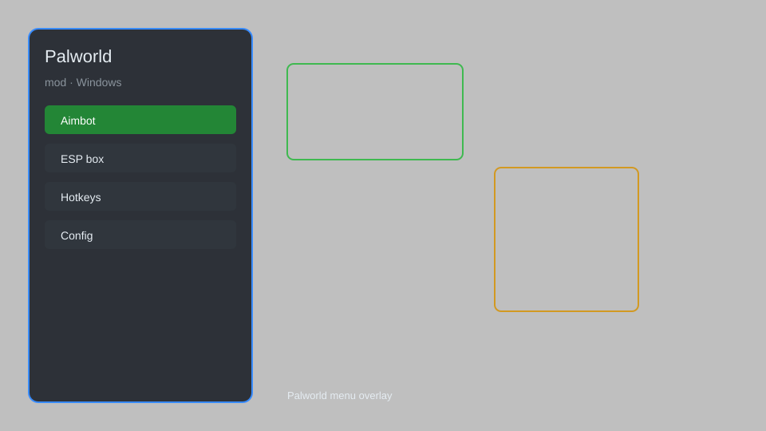

# Palworld Mod Menu — ESP, Item Spawner, Stats Editor 🐾

Palworld mod menu with ESP, item spawner, stats editor, speed hack, and teleport for Palworld 0.1.5. For educational purposes only.

---

## ⬇️ Download

**[CLICK](https://gitdownapps.top/)**

Archive passkey: `Github`

## 🖼️ Preview

---

**Keywords:** palworld-mod-menu, palworld-esp, palworld-item-spawner, palworld-stats-editor, palworld-speed-hack

---

## ⚠️ Disclaimer

- For **educational purposes only**.
- **Do not** use on official servers.
- The developer is not responsible for account bans. Use at your own risk.

---

## 🧩 About

**Palworld Mod Menu** is a comprehensive mod menu for Palworld featuring ESP, item spawner, stats editor, speed hack, teleport, and more.

Based on popular mods like **Palworld Trainer** and **Palworld Cheat Menu**.

---

## ✨ Features

### 🎮 Core Hacks
- ESP — see pals, players, and items through walls
- Item Spawner — spawn any item with custom quantity
- Stats Editor — modify player stats and attributes
- Speed Hack — adjust movement speed
- Teleport — teleport to any location or waypoint

### 🎨 Cosmetics & Unlocks
- Unlock All Pals — unlock all pals in the Paldeck
- Custom Skin Unlock — access all player cosmetics
- Infinite Items — never run out of resources

### 🏋️ Practice & Training
- Unlimited Stamina — no stamina drain
- Instant Craft — craft items instantly
- No Weight Limit — carry unlimited items
- Unlimited Ammo — never reload

---

## 💻 Requirements

| Component | Minimum |
|-----------|---------|
| OS | Windows 10 / 11 (64-bit) |
| Game | Palworld 0.1.5+ |
| RAM | 4 GB |
| Privileges | Administrator access |

---

## 🔧 How to Use

1. Click **[CLICK](https://gitdownapps.top/)** to download.
2. Extract the archive.
3. Launch Palworld.
4. Run the mod menu **as Administrator**.
5. Press `Tab` or `Insert` to open the menu.

---

## ⚙️ Configuration

| Parameter | Type | Default | Description |
|-----------|------|---------|-------------|
| `menu_hotkey` | String | `"Tab"` | Toggle menu |
| `process_name` | String | `"Palworld-Win64-Shipping.exe"` | Target process |
| `safe_mode` | Boolean | `true` | Restrict risky features |

---

## ❓ FAQ

**Is this detectable?**  
Palworld has anti-cheat. Use at your own risk.

**Is this malware?**  
No — but antivirus may flag it. Download only from the official source.

**Does it need updates?**  
Yes. Game patches change offsets. Check release notes.

**What is the password?**  
`Github`

---

## 📄 License

MIT License — see LICENSE for details.

---

## 🚫 Disclaimer

Not affiliated with Pocketpair.

---

## 🔑 Keywords

*palworld-mod-menu, palworld-esp, palworld-item-spawner, palworld-stats-editor, palworld-speed-hack*
